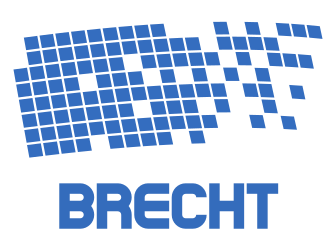

## Brecht 
[](https://travis-ci.com/brechtian/brecht)
[](https://gitter.im/brechtian/community "Gitter chat")

Brecht is an event store for DDD/CQRS/ES systems. Backed up by PostgreSQL, it seamlessly integrates with Apache Kafka.

## Current State
Very very alpha. 

To run "everything" (Kafka, PostgreSQL, Grafana, Prometheus and Brecht itself) in one container:

```
docker run -p8080:8080 -p9092:9092 -p3000:3000 -p5432:5432 -p9090:9090 -p9091:9091 -d brecht:0.1
```

## Commercial Support
Brecht is sponsored by consulting services. The author(s) provide services centered around 
event driven systems. Send a direct email to sebastian.harko@protonmail.com.
 
## Trivia 

In case you are wondering, Brecht is named after [Bertolt Brecht](https://en.wikipedia.org/wiki/Bertolt_Brecht).
 
## Contributing

### Code Contributors

We welcome contributions to Brecht and would love for you to help build Brecht with us.
