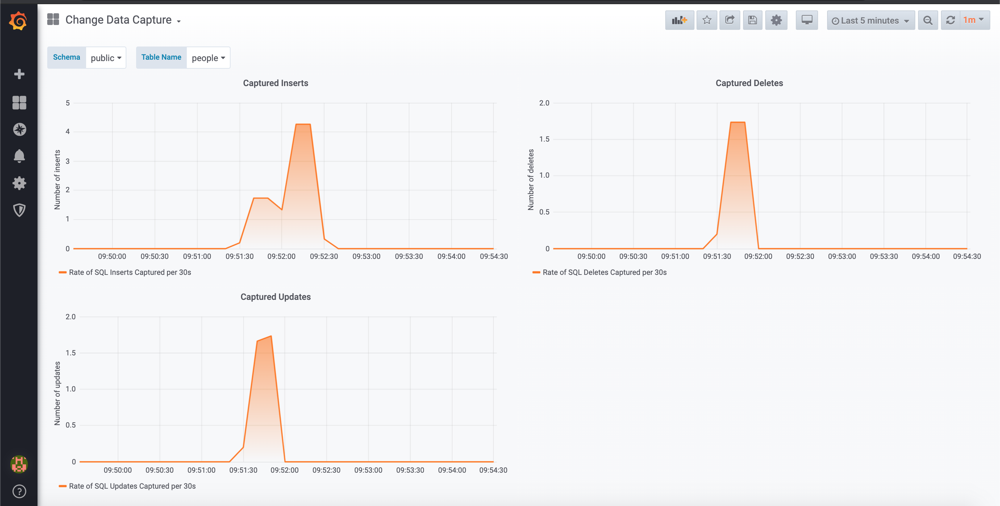

# PostgreSQL CDC

[](https://travis-ci.com/flixdb/flixdb)
[](https://gitter.im/flixdb/community "Gitter chat")


This module provides an Akka Stream Source that can stream changes from a PostgreSQL database. Here, by
"change" we mean database events such as: RowDeleted(..), RowInserted(..), RowUpdated(..). A
typical use case  is a stream that continuously replicates some data from PostgreSQL to ElasticSearch. 
Another common use case is to stream changes from the database to display the changes 
as notifications in a Web UI. Another possible use case is cache invalidation (e.g., trigger cache invalidation
as soon as we are notified of a change to the data in the database). But more generally, this module provides the tooling for implementing the [Strangler Application](https://www.martinfowler.com/bliki/StranglerApplication.html) /
[Event Interception](https://www.martinfowler.com/bliki/EventInterception.html) patterns that Martin Fowler popularized.

## Note

This module is part of FlixDb, but it can be used independently. The module is used internally by FlixDb to stream events from its
PostgreSQL backend to Kafka.

## Roadmap

This is under active development! Some items on our roadmap are: integrating with other streaming
libraries (e.g., ZIO Streams), providing a clean and friendly API for Java users and fans and relentlessly refactoring and making the code better. 

## How it Works

This Akka Stream Source makes use of the "logical decoding" feature of PostgreSQL (available since PostgreSQL 9.4).
It uses the `test_decoding` plugin that comes pre-packaged with PostgreSQL. Enabling a logical replication slot
in PostgreSQL requires very little configuration, and it generally has minimal performance overhead. Please consult
the PostgreSQL documentation to understand any performance implications: [the PostgreSQL documentation](https://www.postgresql.org/docs/10.4/static/logicaldecoding-example.html).
**Note**: we also support the `wal2json` [plugin](https://github.com/eulerto/wal2json). 

## Events Emitted

This Akka Streams Source emits elements of the type [ChangeSet](). A change set is a set of changes that share a
transaction id. A [Change]() can be one of the following:

* [RowInserted]()(schema, tableName, data: Map[String, String])
* [RowUpdated]()(schema, tableName, dataNew: Map[String, String], dataOld: Map[String, String])
* [RowDeleted]()(schema, tableName, data: Map[String, String])

## Artifacts

```
resolvers += Resolver.bintrayRepo("flixdb", "maven")
libraryDependencies += "com.flixdb" %% "cdc" % "0.1"
```

### Reported Issues
Feel free to use [Github](https://github.com/flixdb/flixdb/issues) not only to report issues but also to provide general feedback. You are also very welcome
to discuss anything related to this module on the [Gitter](https://gitter.im/flixdb/community "Gitter chat") channel. 

### Samples

Sample applications are available at this link: [examples](https://github.com/flixdb/flixdb/tree/master/cdc/samples/). 

## Usage

### PostgreSQL Configuration (Required)

According to the PostgreSQL documentation, before you can use logical decoding, you must set `wal_level` to `logical` and
`max_replication_slots` to at least 1. This can be as simple as:

```bash
echo "wal_level=logical" >> /etc/postgresql/10/main/postgresql.conf
echo "max_replication_slots=8" >> /etc/postgresql/10/main/postgresql.conf
```

If you use a cloud-based managed database service (e.g., AWS RDS), you usually don't have direct access to the `postgresql.conf` configuration file and you have to use
a configuration panel instead:

* On AWS RDS:
    * Use option groups: you simply have to set the ```rds.logical_replication``` parameter to ```1``` in the option group associated with your RDS instance. See [the AWS RDS documentation](https://aws.amazon.com/blogs/aws/amazon-rds-for-postgresql-new-minor-versions-logical-replication-dms-and-more/).

### Source Settings

To build a Source, we need a DataSource (we recommend HikariCP) and [PgCdcSourceSettings](). Our goal is 
to optimize the defaults for [PgCdcSourceSettings]() so that for most use cases you'll never have to change
anything. However, you will need to specify the slotName. 


[PgCdcSourceSettings]():

| Setting                 | Meaning                                                             | Default      | Required |
| ------------------------|---------------------------------------------------------------------|--------------|----------|
| slotName                | Name of the logical replication slot                                | null         | yes      |
| createSlotOnStart       | Create the logical replication slot on start (if it doesn't exist)  | true         | no       |
| dropSlotOnFinish        | Drop the logical replication slot on stop                           | false        | no       |
| closeDataSourceOnFinish | Close the data source when the stream stops                         | false        | no       |
| plugin                  | TestDecoding or Wal2Json                                            | TestDecoding | no       |
| columnsToIgnore         | What columns to ignore per table. * syntax is supported: use it to ignore all columns in a table or all columns with a given name regardless of what table they are in | none | no |
| mode                    | Choose between "Get" (think "at most once") or  "Peek" (think "at least once"). If you choose "Peek", you'll need the [Ack Sink] to acknowledge consumption of the event  | Get | no |
| maxItems                | Maximum number of changes to pull in one go                         | 128          | no           |
| pollInterval            | Duration between polls                                              | 250 ms       | no           |

Example source settings:

Scala

```
val changeDataCaptureSettings = PgCdcSourceSettings(slotName = "cdc") 
  .withCreateSlotOnStart(true)
  .withMode(Modes.Get)
  .withColumnsToIgnore(Map("images" -> List("img"), "user_personal_information" -> List("*")))
  // ignore the img column in the images table and ignore the whole user_personal_information table
```

### Source Usage

Without further ado, a minimalist example:

```
implicit val system: ActorSystem = ActorSystem()
  
val slotName = "slot_name"

ChangeDataCapture(PostgreSQLInstance(hikariDataSource))
  .source(PgCdcSourceSettings(slotName))
  .log("postgresqlcdc", cs => s"Captured changes: ${cs.toString}")
  .withAttributes(Attributes.logLevels(onElement = Logging.InfoLevel))
  .to(Sink.ignore)
  .run()

```

### Ack Sink Settings

You'll only need an Ack Sink if you choose the Peek mode (think "at least once delivery").

To build a Sink we need a DataSource (e.g., HikariCP) and a [PgAckSettings]() object.
Our goal is to optimize the defaults of [PgAckSettings]() so that for most use cases you'll never have to change
anything. However, you'll need to specify the slotName. 


[PgAckSinkSettings]()

|Setting               |Meaning                                                                     | Default              | Required |
|----------------------|----------------------------------------------------------------------------|----------------------|----------|
| slotName             | Name of the logical replication slot                                       |                      | yes      |               
| maxItems             | Ideal number of items to acknowledge at once                               | 16                   | no       |
| maxItemsWait         | maximum duration for which the stage waits until maxItems have accumulated | 3 second             | no       |


### Ack Sink Usage

You want to map these database change events (i.e. RowInserted) to domain events
(i.e. UserRegistered - aiming to adopt a Domain Driven Design approach), publish the domain events to a queue (e.g, Kafka or AWS SQS)
, and use the Ack Sink to acknowledge consumption.

```

// Define your domain event
case class UserRegistered(id: String)

val slotName = "slot_name"

val cdc = ChangeDataCapture(PostgreSQLInstance(hikariDataSource))
val source = cdc.source(PgCdcSourceSettings(slotName))
val ackSink = cdc.ackSink(PgCdcAckSinkSettings(slotName))

source
  .mapConcat(_.changes)
  .collect {
    case change @ RowInserted("public", "users", _, _, data, _) =>
      val userId = data("user_id")
      (change, UserRegistered(userId))
  }
  .map(???) // do something useful e.g., publish to SQS
  .map(t => AckLogSeqNum(t._2.commitLogSeqNum))
  .to(ackSink) // acknowledge
  .run()

```

## Monitoring

This module uses the Prometheus Java client for instrumentation purposes. Most of our users tend to use 
Prometheus in conjunction with Grafana. We recommend the
[prometheus-akka-http](https://github.com/lonelyplanet/prometheus-akka-http) for exposing
a metrics endpoint. 
In build.sbt:

```
resolvers ++= Seq(Resolver.bintrayRepo("lonelyplanet", "maven"))
val prometheusAkkaHttp = "com.lonelyplanet" %% "prometheus-akka-http" % "0.5.0" // or whatever the latest version is
```

In your main:

```
  DefaultExports.register(ChangeDataCapture.registry)

  val metricsEndpoint = new MetricsEndpoint(ChangeDataCapture.registry)
  val routes = metricsEndpoint.routes
  val bindingFuture = Http().bindAndHandle(routes, interface = "0.0.0.0", port = 9091)

```

We provide a Grafana dashboard that you can download [here](src/main/grafana/Dashboard.json). 



## Limitations

* The Source cannot capture events regarding changes to table structures (i.e. column removed, table dropped, table
index added, change of column type, etc.).
* When a row update is captured, the previous version of the row is lost / not available.
    * However, if the table has a non-default `REPLICA IDENTITY` setting this does not happen. To get the full previous version of the row: `ALTER TABLE "TABLE_NAME" REPLICA IDENTITY FULL`.
* It doesn't work with older versions of PostgreSQL (i.e < 9.4).


## Important Notes

1. Remember to drop the slot when you decide you no longer need the change data capture pipeline
```
SELECT * FROM pg_drop_replication_slot('name')
``` 

## Support

FlixDb is sponsored by consulting services. The author(s) provide services centered around 
event driven systems. Send a direct email to flixdb@protonmail.com.


